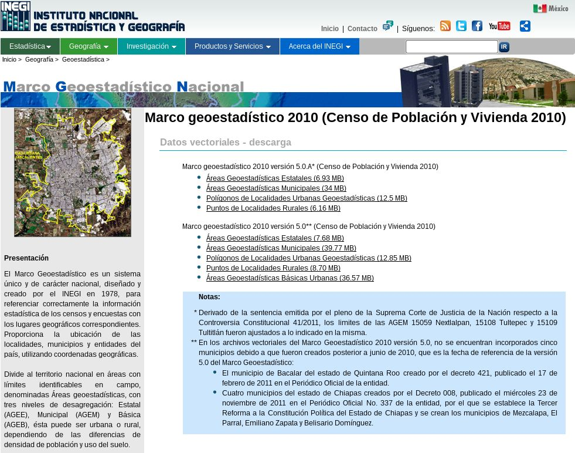

# Marco Geoestadístico Nacional 2010

En el siguiente URL...

    http://www.inegi.org.mx/geo/contenidos/geoestadistica/m_geoestadistico_2010.aspx

### Descargar

Cámbiese al directorio **Descargas**, que es donde tendremos los archivos ZIP que bajaremos.

    $ cd Descargas

De clic en cada enlace. O bien, use wget para hacer una descarga directa:

    $ wget http://mapserver.inegi.org.mx/MGN/mge2010v5_0a.zip
    $ wget http://mapserver.inegi.org.mx/MGN/mgm2010v5_0a.zip
    $ wget http://mapserver.inegi.org.mx/MGN/mglu2010v5_0a.zip
    $ wget http://mapserver.inegi.org.mx/MGN/mglr2010v5_0a.zip

### Desempacar

Desempaque todos los archivos ZIP. Los archivos creados irán al directorio **Desempacados**.

    $ unzip -d ../Desempacados/ mge2010v5_0a.zip
    $ unzip -d ../Desempacados/ mgm2010v5_0a.zip
    $ unzip -d ../Desempacados/ mglu2010v5_0a.zip
    $ unzip -d ../Desempacados/ mglr2010v5_0a.zip

Vaya al directorio Desempacados

    $ cd ../Desempacados

### Cambiar el nombre de los archivos desempacados

Esto es necesario para que los nombres de las tablas dentro de los archivos SQL correspondan a las nuestras:

    $ mv mge2015v6_2.shp mgn_entidades.shp
    $ mv mge2015v6_2.shx mgn_entidades.shx
    $ mv mge2015v6_2.dbf mgn_entidades.dbf
    $ mv mge2015v6_2.prj mgn_entidades.prj

    $ mv mgm2015v6_2.shp mgn_municipios.shp
    $ mv mgm2015v6_2.shx mgn_municipios.shx
    $ mv mgm2015v6_2.dbf mgn_municipios.dbf
    $ mv mgm2015v6_2.prj mgn_municipios.prj

    $ mv mglu2015v6_2.shp mgn_localidades_urbanas.shp
    $ mv mglu2015v6_2.shx mgn_localidades_urbanas.shx
    $ mv mglu2015v6_2.dbf mgn_localidades_urbanas.dbf
    $ mv mglu2015v6_2.prj mgn_localidades_urbanas.prj

    $ mv mglr2015v6_2.shp mgn_localidades_rurales.shp
    $ mv mglr2015v6_2.shx mgn_localidades_rurales.shx
    $ mv mglr2015v6_2.dbf mgn_localidades_rurales.dbf
    $ mv mglr2015v6_2.prj mgn_localidades_rurales.prj

### Convertir archivos SHP a SQL

Primero siga el procedimiento del **Sistema de Referencia de Coordenadas (SRC)** que está en su directorio correspondiente.

El comando **shp2pgsql** es para crear archivos SQL con comandos INSERT que agregarán registros a la base de datos:

    $ shp2pgsql -s 97999 -a -e -i -W LATIN1 mgn_entidades.shp > mgn_entidades.sql
    $ shp2pgsql -s 97999 -a -e -i -W LATIN1 mgn_municipios.shp > mgn_municipios.sql
    $ shp2pgsql -s 97999 -a -e -i -W UTF8   mgn_localidades_urbanas.shp > mgn_localidades_urbanas.sql
    $ shp2pgsql -s 97999 -a -e -i -W LATIN1 mgn_localidades_rurales.shp > mgn_localidades_rurales.sql

Donde el parámetro -s indica el SRC, -a que no haya CREATE, -e comandos individales, -i enteros int4 y -W la codificación de origen.

### Alimentar la base de datos

Cree las tablas en la base de datos:

    $ cd ..
    $ psql -U inegi -f 01.11-mgn_entidades.sql inegi
    $ psql -U inegi -f 01.12-mgn_municipios.sql inegi
    $ psql -U inegi -f 01.13-mgn_localidades_urbanas.sql inegi
    $ psql -U inegi -f 01.14-mgn_localidades_rurales.sql inegi

Ejecute los archivos que insertarán:

    $ cd Desempacados
    $ psql -U inegi -f mgn_entidades.sql inegi
    $ psql -U inegi -f mgn_municipios.sql inegi
    $ psql -U inegi -f mgn_localidades_urbanas.sql inegi
    $ psql -U inegi -f mgn_localidades_rurales.sql inegi
