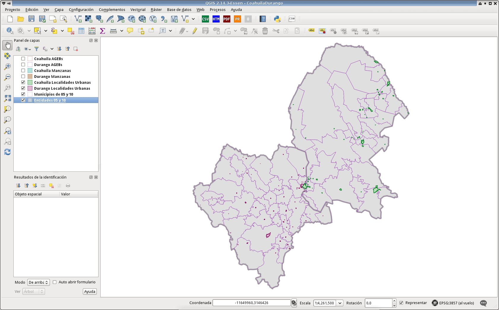
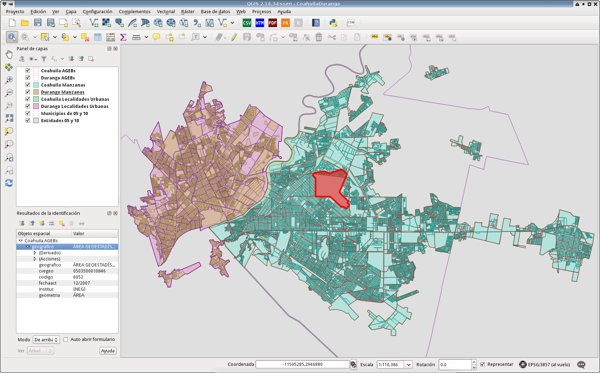

# INEGI

Apuntes y scripts para trabajar con datos abiertos de INEGI. Programando con [Python](https://www.python.org/), importando los datos a la base de datos [PostgreSQL](https://www.postgresql.org/) y usando **GNU/Linux** como sistema operativo.

### Requerimientos

* GNU/Linux instalado con el entorno gráfico de su preferencia.
* PostgreSQL.
* PostGIS.
* Python versión 3 más las librerías:
    * [psycopg2](https://pypi.python.org/pypi/psycopg2) es un adaptador para PostgreSQL.
* QGIS.

### 1) inicie la base de datos

Si no lo ha hecho, cree el usuario **inegi** en PostgreSQL sin privilegio de crear nuevas bases de datos y sin ser superusuario.

    $ createuser -D -S inegi

Cree la base de datos **inegi** otorgándole la propiedad al usuario **inegi**:

    $ createdb -O inegi inegi

### 2) Ejecute CrearBaseDatos.sh

Este script ejecutará en el orden debido cada script que descarga, desempaca e inserta los registros a la B.D.:

1. SistemaReferenciaCoordenadas/04Insertar.sh
2. MarcoGeoestadisticoNacional2010/01Descargar.sh
3. MarcoGeoestadisticoNacional2010/02CrearTablas.sh
4. MarcoGeoestadisticoNacional2010/03Convertir.sh
5. MarcoGeoestadisticoNacional2010/04Insertar.sh

No deje de leer los archivos README.md que hay dentro de cada uno de los directorios.

### Ejemplo del Marco Geostadístico Nacional 2010

Filtrando los estados 05 (Coahuila de Zaragoza) y 10 (Durango) en QGIS:

### Ejemplo de la Cartografía Geostadística cierre Censo 2010

Mostrando AGBEs y Manzanas:

