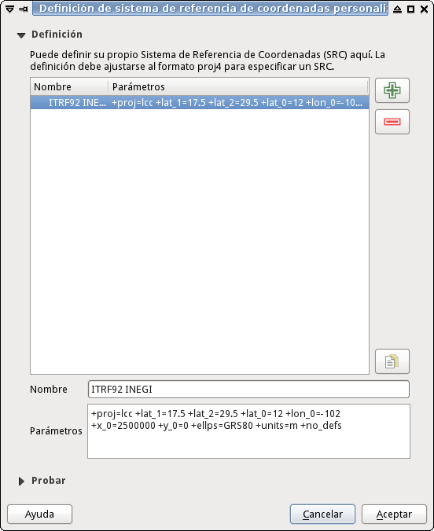

# Sistema de Referencia de Coordenadas (SRC)

En [Spatial Reference](http://spatialreference.org/) encontrará el **ITRF92 INEGI** con SG-ORG número 7999:

    http://spatialreference.org/ref/sr-org/7999/

El archivo **itrf92-inegi-spatial-ref-sys.sql** tiene este contenido...

    INSERT into spatial_ref_sys
        (srid, auth_name, auth_srid, proj4text,
        srtext)
    VALUES
        (97999, 'sr-org', 7999, '',
        'PROJCS["MEXICO_ITRF_1992_LCC",GEOGCS["ITRF_1992",DATUM["D_ITRF_1992",SPHEROID["GRS_1980",6378137.0,298.257222101]],PRIMEM["Greenwich",0.0],UNIT["Degree",0.0174532925199433]],PROJECTION["Lambert_Conformal_Conic"],PARAMETER["False_Easting",2500000.0],PARAMETER["False_Northing",0.0],PARAMETER["Central_Meridian",-102.0],PARAMETER["Standard_Parallel_1",17.5],PARAMETER["Standard_Parallel_2",29.5],PARAMETER["Latitude_Of_Origin",12.0],UNIT["Meter",1.0],AUTHORITY["INEGI","200007"]]');

Recién creada la base de datos en PostgreSQL, debería agregar el **SRC**; puede hacerlo de forma manual con el comando...

    $ psql -c "CREATE EXTENSION postgis;" inegi
    $ psql -c "CREATE EXTENSION postgis_topology;" inegi
    $ psql -f src-itrf92-inegi.sql inegi

### Agregar el SRC a QGIS

